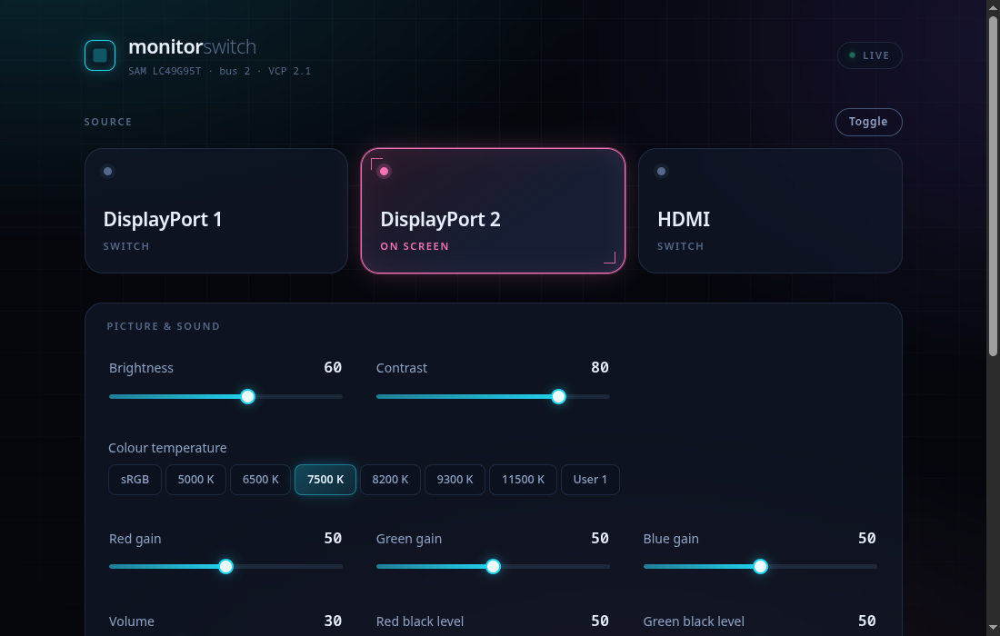

<div align="center">

# monitor-switch

**Switch your monitor's input source with a keypress — from a Raspberry Pi that is
always on.**

A small always-on control device sits on your monitor's HDMI input, speaks DDC/CI,
and exposes every control the monitor offers over HTTP, a web UI, and Home Assistant.

[Deutsche Fassung](README.de.md) · [Hardware findings](docs/hardware-findings.md) ·
[Writing a monitor profile](docs/profiles.md)

</div>

---

> **Status: under construction.**
> The hardware side is fully validated and documented — see
> [`docs/hardware-findings.md`](docs/hardware-findings.md). The service, web UI and
> Ansible role are being built now. This notice goes away when the first release lands.

## The problem

Two machines share one monitor. Switching between them means diving into the OSD menu
with a tiny joystick behind the panel. Every single time.

The obvious fix is DDC/CI — a standard that lets software tell a monitor to change its
input. Except:

- **On many monitors DDC/CI simply does not work over DisplayPort.** On the Samsung
  Odyssey G9 this project was built around, the DDC slave does not answer on DP at all.
  Only HDMI works.
- **You cannot switch *away* from a machine that is switched off.** If machine A is
  showing and machine B is asleep, neither of them can help you.
- **Monitors lie about their own capabilities.** The G9 reports input source values
  that are flatly wrong, and its read values differ from its write values.

## The solution

Put a **Raspberry Pi Zero 2 W on the monitor's HDMI input.** It runs on 0.4–0.7 W,
costs almost nothing, and is completely independent of the machines it switches
between.

Because the Pi outputs a real video signal, the HDMI port stops being a sacrifice and
becomes a genuine third source — and the most dangerous DDC failure mode (a monitor
displaying an input with no signal wedges its DDC engine) disappears structurally.

```
   ┌──────────┐  DP1
   │ Machine A├──────────┐
   └──────────┘          │      ┌─────────┐
                         ├──────┤ Monitor │
   ┌──────────┐  DP2     │      └────┬────┘
   │ Machine B├──────────┘           │ HDMI  ← DDC/CI control channel
   └──────────┘                      │         (and a real third source)
                              ┌──────┴──────┐
                              │  Pi Zero 2W │  monitor-switch
                              └─────────────┘
                                     │
              ┌──────────────────────┼──────────────────────┐
              │                      │                      │
          Web UI                HTTP API              Home Assistant
       (any browser)         (hotkeys, scripts)          (MQTT)
```



## What it does

- **Switch inputs** from a hotkey, a browser, your phone, or a Home Assistant
  dashboard — regardless of which machine is currently on
- **Control everything else the monitor exposes**: brightness, contrast, volume, mute,
  picture mode, colour temperature, RGB gain and black level
- **Read what the monitor knows about itself**: usage hours, firmware level, refresh
  rates, power state
- **Works with any DDC/CI monitor**, not just the one it was built for — every value
  read and written is defined in a profile you can edit
- **Survives monitors that lie** — profiles override auto-detection where the
  capabilities string is wrong
- **Never strands you on a blank screen** — a guard refuses to switch to the Pi's own
  input unless the Pi is verifiably outputting video

## Quick start

You need a Raspberry Pi (any model with HDMI) running Raspberry Pi OS, connected to
your monitor's HDMI input, reachable over SSH.

```bash
git clone https://github.com/DimpiM/monitor-switch.git
cd monitor-switch/ansible

cp inventory.example.ini inventory.ini
cp group_vars/all.example.yml group_vars/all.yml
# edit both: your Pi's address, and which inputs you want exposed

ansible-playbook -i inventory.ini site.yml
```

Then open `http://<your-pi>/` in a browser.

The playbook installs the packages, configures I²C, forces a stable video mode,
deploys the service, and refuses to finish if the health check does not answer.

## Does my monitor work?

Run this on the Pi once it is connected:

```bash
sudo apt install -y ddcutil i2c-tools
BUS=$(basename "$(readlink -f /sys/class/drm/card*-HDMI-A-1/ddc)" | sed 's/i2c-//')
sudo i2cdetect -y "$BUS" | grep '^30:'
```

If `37` appears in that row, your monitor speaks DDC/CI and you are in business. If
only `30` and `50` show up, the monitor exposes an EDID but no DDC/CI on that
connector — try the other inputs, or a different cable.

Details and failure modes: [`docs/troubleshooting.md`](docs/troubleshooting.md).

## Monitor profiles

Auto-detection reads the monitor's capabilities string and builds the feature list
from it. That is enough for well-behaved monitors.

It is **not** enough for the Samsung Odyssey G9, which declares input source values
that do not exist and hides the ones that work. So profiles can override anything:

```yaml
match: { mfg: SAM, model: LC49G95T }
name: Samsung Odyssey G9
features:
  input_source:
    vcp: 0x60
    type: select
    options:
      # this monitor returns different values than it accepts
      - { id: dp1,  label: DisplayPort 1, write: 0x0f, read: 0x03 }
      - { id: dp2,  label: DisplayPort 2, write: 0x10, read: 0x04 }
      - { id: hdmi, label: HDMI,          write: 0x11, read: 0x01,
          guard: local_video }
```

A profile is picked automatically by manufacturer and model from the EDID. If yours
needs one, the `probe` command walks you through finding the values safely — it
reverts automatically if you do not confirm, so a wrong guess cannot strand you.

**Contributing a profile for your monitor is the single most useful thing you can do
for this project.**

Full guide: [`docs/profiles.md`](docs/profiles.md).

## Home Assistant

The service announces itself over MQTT discovery. Every control becomes an entity —
a dropdown for the input source, sliders for brightness and volume, sensors for the
read-only values — and the state stays in sync because the service polls the monitor,
not just its own last command.

Setup: [`docs/home-assistant.md`](docs/home-assistant.md).

## Hardware notes

| Part | Note |
|---|---|
| Raspberry Pi Zero 2 W | Any Pi works; the Zero 2 W is chosen for 0.4–0.7 W idle draw |
| **Mini-HDMI (type C) → HDMI (type A) cable** | **The classic mistake.** The Zero family has *mini*-HDMI. *Micro*-HDMI (type D) is the Pi 4 and Pi 5. They look alike and do not fit each other. |
| Power supply | On the **PWR** port, not the USB data port |
| microSD | Class 10 is plenty |

## Security

There is no authentication. The service is meant for a trusted LAN and binds to a
configurable address — **not** `0.0.0.0` by default. Do not expose it to the internet.

## Documentation

| | |
|---|---|
| [Hardware findings](docs/hardware-findings.md) | Every measurement, every pitfall, and why the design looks like this |
| [Monitor profiles](docs/profiles.md) | Writing and contributing a profile |
| [Home Assistant](docs/home-assistant.md) | MQTT discovery setup |
| [Troubleshooting](docs/troubleshooting.md) | When DDC misbehaves |

## Credits

Built on [`ddcutil`](https://www.ddcutil.com/) by Sanford Rockowitz, which does all
the actual DDC/CI work.

## License

MIT — see [LICENSE](LICENSE).
